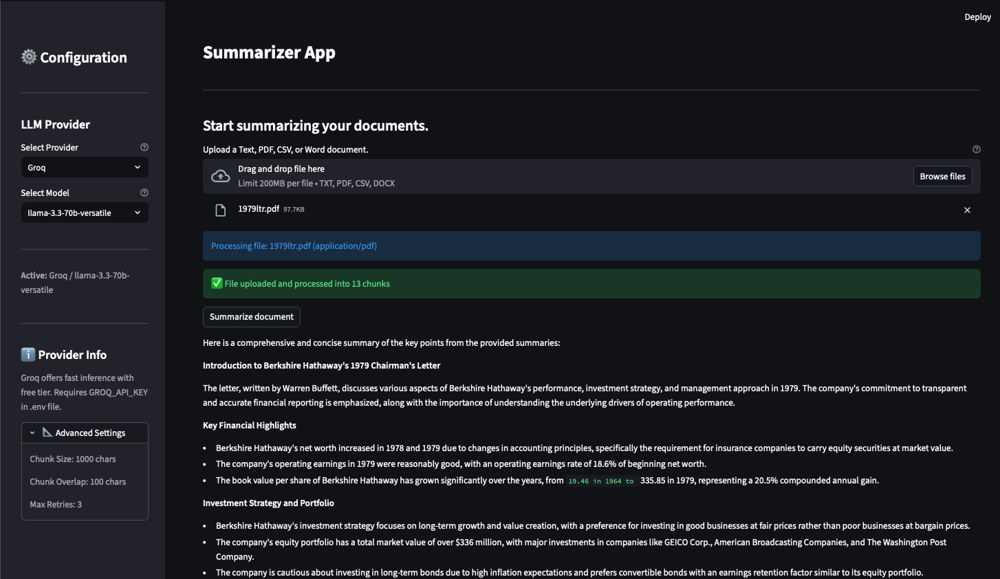
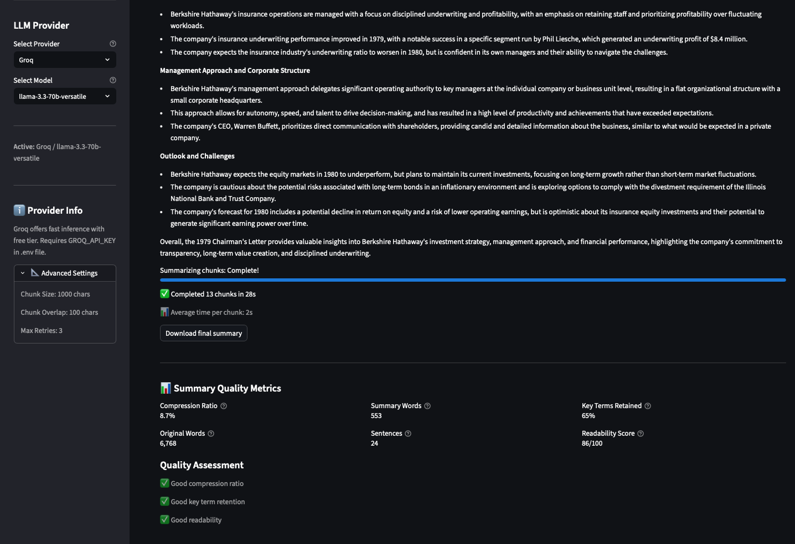

# Document Summarizer

A Streamlit application that summarizes text, PDF, CSV, and Word documents using LLMs. Features include automatic retry logic, progress tracking, quality metrics, and dynamic LLM provider switching.



---

## Features

- **Multi-Format Support**: Process TXT, PDF, CSV, and DOCX files
- **Two-Stage Summarization**: Chunk-level summaries combined into a final cohesive summary
- **Progress Tracking**: Real-time progress bars with ETA during processing
- **Quality Metrics**: Compression ratio, key term retention, and readability scores
- **LLM Provider Switching**: Switch between OpenAI and Groq models via sidebar
- **Download**: Export summaries as text files
- **Retry Logic**: Automatic retries with exponential backoff for API failures
- **Logging**: Detailed logs for debugging and monitoring

---

## Screenshots

### Main Interface


### Quality Metrics


---

## Example

**Input**: [1979 Berkshire Hathaway Chairman's Letter (PDF)](screenshots/1979ltr.pdf)

**Output Summary**:

> **Introduction to Berkshire Hathaway's 1979 Chairman's Letter**
>
> The letter, written by Warren Buffett, discusses various aspects of Berkshire Hathaway's performance, investment strategy, and management approach in 1979.
>
> **Key Financial Highlights**
> - Berkshire Hathaway's net worth increased in 1978 and 1979 due to changes in accounting principles
> - Operating earnings rate of 18.6% of beginning net worth
> - Book value per share grew from $19.46 in 1964 to $335.85 in 1979 (20.5% compounded annual gain)
>
> **Investment Strategy**
> - Focus on long-term growth and value creation
> - Preference for investing in good businesses at fair prices
> - Equity portfolio with total market value over $336 million
>
> **Insurance Operations**
> - Disciplined underwriting with focus on profitability
> - Underwriting profit of $8.4 million in a specific segment
>
> **Management Approach**
> - Flat organizational structure with delegated authority
> - Small corporate headquarters enabling autonomy and speed

[Full summary text](screenshots/final_summary-4.txt)

---

## Installation

### 1. Clone the repository
```bash
git clone <repository-url>
cd summarizer
```

### 2. Create virtual environment
```bash
python -m venv venv
source venv/bin/activate  # Windows: venv\Scripts\activate
```

### 3. Install dependencies
```bash
pip install -r requirements.txt
```

### 4. Configure API keys
```bash
cp .env.example .env
```

Edit `.env` and add your API keys:
```bash
OPENAI_API_KEY=sk-...your-key...
GROQ_API_KEY=gsk_...your-key...   # Optional
```

**Get API Keys**:
- OpenAI: https://platform.openai.com/api-keys
- Groq (free tier): https://console.groq.com/keys

---

## Usage

### Start the application
```bash
streamlit run app.py
```

Opens at `http://localhost:8501`

### Steps
1. **Upload** a document (TXT, PDF, CSV, or DOCX)
2. **Select** LLM provider and model from sidebar
3. **Click** "Summarize document"
4. **View** progress, summary, and quality metrics
5. **Download** the summary as a text file

---

## Configuration

All settings are in `config.yaml`:

```yaml
llm:
  provider: "openai"           # openai or groq
  openai_model: "gpt-4o-mini"
  groq_model: "llama-3.3-70b-versatile"

document_processing:
  chunk_size: 1000
  chunk_overlap: 100

retry:
  max_attempts: 3
  min_wait_seconds: 2
  max_wait_seconds: 10
```

---

## Project Structure

```
summarizer/
├── app.py                 # Main Streamlit application
├── document_loaders.py    # Document processing (TXT, PDF, CSV, DOCX)
├── config_loader.py       # Configuration management
├── progress_tracker.py    # Progress bars and ETA calculation
├── quality_metrics.py     # Summary quality analysis
├── config.yaml            # Application settings
├── requirements.txt       # Dependencies
├── pytest.ini             # Test configuration
├── tests/                 # Unit tests
│   ├── test_document_loaders.py
│   ├── test_config_loader.py
│   ├── test_progress_tracker.py
│   └── test_quality_metrics.py
└── screenshots/           # Example screenshots and files
    ├── Summarizer_Streamlit_UI.png
    ├── Summary_Quality_Metrics.png
    ├── 1979ltr.pdf
    └── final_summary-4.txt
```

---

## Running Tests

```bash
python -m pytest tests/ -v
```

---

## Supported File Types

| Format | Extension | Notes |
|--------|-----------|-------|
| Text | .txt | Plain text files |
| PDF | .pdf | Text-based PDFs (not scanned images) |
| CSV | .csv | Treated as text content |
| Word | .docx | Extracts text and tables |

---

## Error Handling

The application handles common errors gracefully:

| Error | Message | Action |
|-------|---------|--------|
| Rate Limit | "API rate limit exceeded" | Wait and retry |
| Connection | "Unable to connect to AI service" | Check internet |
| API Error | "AI service error" | Check API key |
| Unsupported File | "File type not supported" | Use supported format |

Automatic retries: 3 attempts with exponential backoff (2-10 seconds)

---

## Limitations

- **File Size**: Optimized for documents up to ~50 pages
- **PDFs**: Text-based only (no OCR for scanned documents)
- **API Costs**: OpenAI charges per token; Groq has free tier with limits
- **Internet**: Required for LLM API calls

---

## Technologies

- **Streamlit** - Web interface
- **LangChain** - LLM orchestration
- **OpenAI / Groq** - LLM providers
- **PyPDF** - PDF processing
- **python-docx** - Word document processing

---

## License

This project is provided as-is for educational and personal use.
